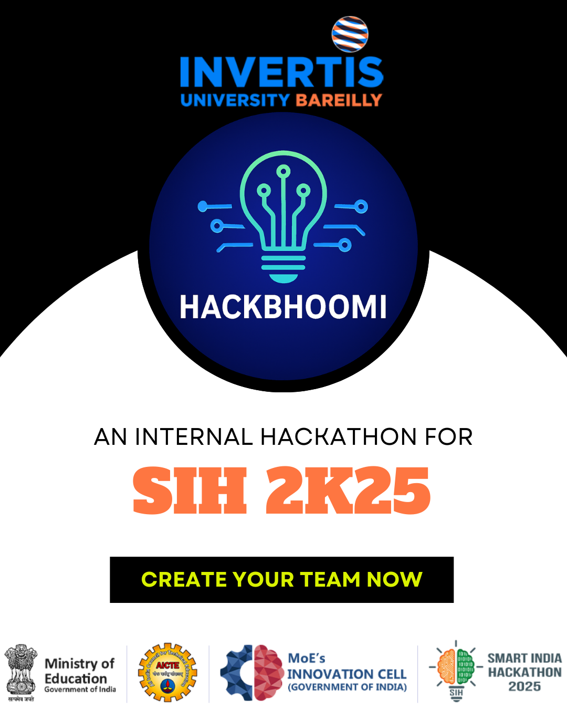
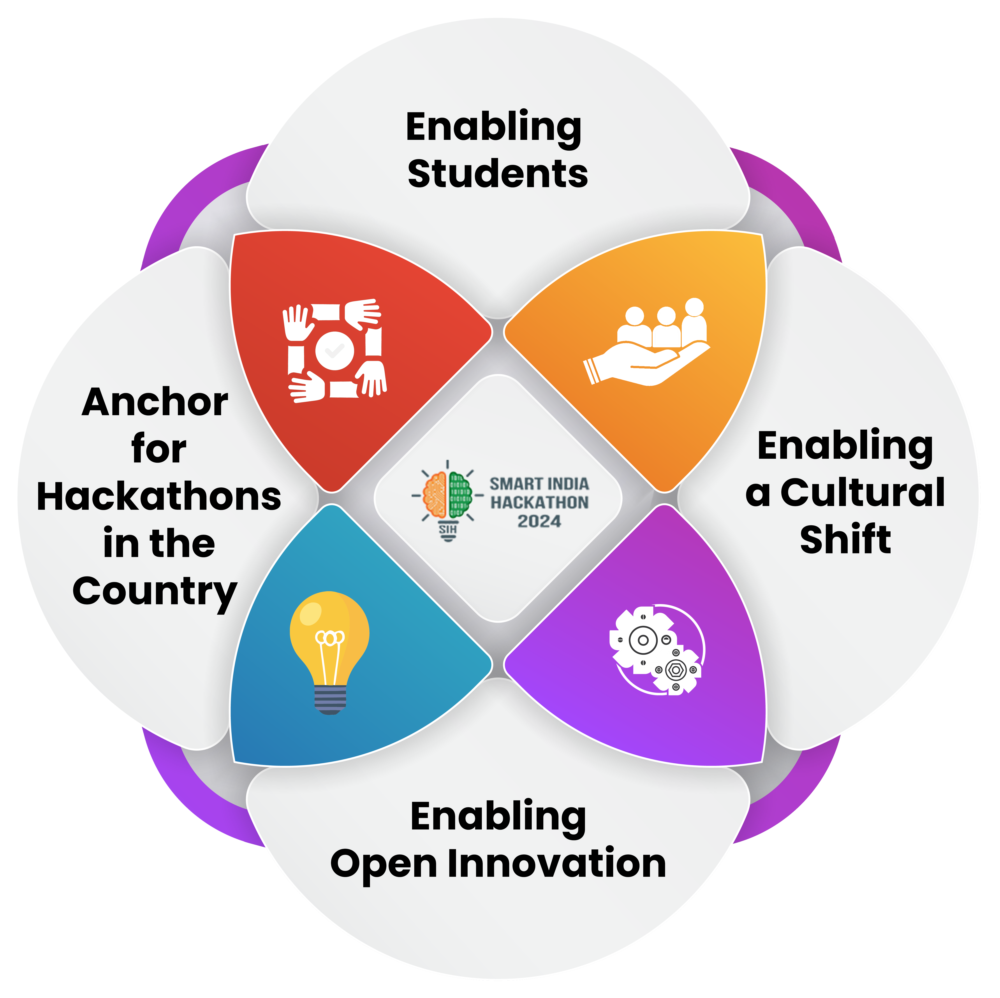
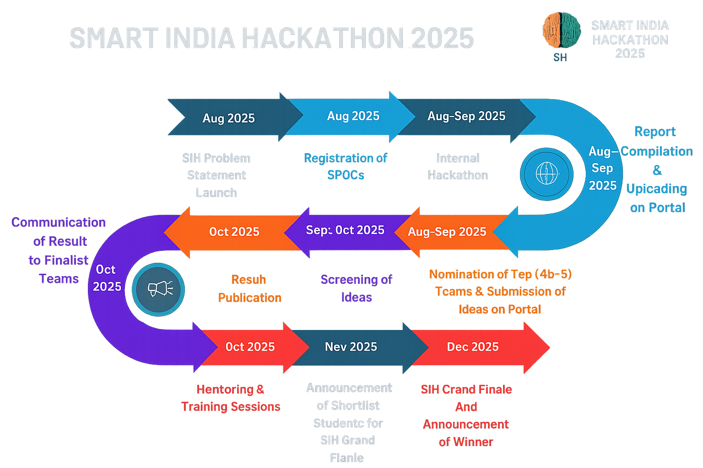

# 🏆 HackBhoomi 2025 - Smart India Hackathon

[](https://nextjs.org/)
[](https://reactjs.org/)
[](https://www.typescriptlang.org/)
[](https://tailwindcss.com/)

> **HackBhoomi 2025** - The official internal hackathon platform for Invertis University students participating in Smart India Hackathon 2025. Your gateway to national recognition and innovation excellence.

## 🌟 Overview

HackBhoomi is Invertis University's premier hackathon event designed to identify and nurture the brightest minds for Smart India Hackathon 2025. This comprehensive web platform provides everything participants need - from registration to final submission.

### ✨ Key Features

- **🎯 Complete SIH Information** - Comprehensive details about Smart India Hackathon5
- **📋 Easy Registration** - Streamlined team registration process
- **🏃‍♂️ Interactive Timeline** - Clear event schedule and milestones
- **🎨 17 Innovation Tracks** - Detailed information about all SIH tracks
- **📱 Responsive Design** - Perfect experience across all devices
- **🎵 Interactive Elements** - Engaging user experience with animations
- **📄 Resource Center** - Access to PDFs, guidelines, and instructions

## 🚀 Live Demo

🔗 **[Visit HackBhoomi 2025](https://hackbhoomi.vercel.app)**

## 📸 Screenshots

### Hero Section


### SIH Process Flow


### Timeline


## 🛠️ Tech Stack

### Frontend
- **Next.js 15.2.4** - React framework with App Router
- **React 18.3.1** - UI library
- **TypeScript 5** - Type safety
- **Tailwind CSS 3.4.17** - Utility-first CSS framework

### UI Components
- **Radix UI** - Accessible component primitives
- **Lucide React** - Beautiful icons
- **Framer Motion** - Smooth animations
- **Embla Carousel** - Touch-friendly carousels

### Development Tools
- **ESLint** - Code linting
- **PostCSS** - CSS processing
- **Autoprefixer** - CSS vendor prefixes

## 📁 Project Structure

```
HackBhoomi/
├── app/                    # Next.js App Router
│   ├── globals.css        # Global styles
│   ├── layout.tsx         # Root layout
│   ├── page.tsx          # Home page
│   ├── sitemap.ts        # SEO sitemap
│   └── robots.ts         # SEO robots
├── components/            # React components
│   ├── ui/               # Reusable UI components
│   ├── HeroSection.tsx   # Landing hero
│   ├── AboutSIH.tsx      # SIH information
│   ├── Timeline.tsx      # Event timeline
│   ├── TracksSelection.tsx # SIH tracks
│   ├── FAQ.tsx           # Frequently asked questions
│   ├── Navbar.tsx        # Navigation
│   └── Footer.tsx        # Site footer
├── lib/                  # Utility functions
├── public/               # Static assets
│   ├── images/          # UI images
│   ├── edtech/          # Track images
│   ├── healthcare/      # Track images
│   ├── environment/     # Track images
│   ├── finance/         # Track images
│   ├── *.pdf           # Resource documents
│   └── *.mp3           # Audio files
└── styles/              # Additional styles
```

## 🏃‍♂️ Quick Start

### Prerequisites
- Node.js 18+ 
- npm or yarn or pnpm

### Installation

1. **Clone the repository**
```bash
git clone https://github.com/yourusername/hackbhoomi-2025.git
cd hackbhoomi-2025
```

2. **Install dependencies**
```bash
npm install
# or
yarn install
# or
pnpm install
```

3. **Run development server**
```bash
npm run dev
# or
yarn dev
# or
pnpm dev
```

4. **Open in browser**
```
http://localhost:3000
```

## 📋 Available Scripts

```bash
# Development
npm run dev          # Start development server
npm run build        # Build for production
npm run start        # Start production server
npm run lint         # Run ESLint

# Deployment
./deploy.sh          # Unix/Linux deployment script
deploy.bat           # Windows deployment script
```

## 🚀 Deployment

### Quick Deploy (Recommended)

**Vercel** (Easiest)
```bash
npm i -g vercel
vercel --prod
```

**Netlify**
```bash
npm i -g netlify-cli
npm run build
netlify deploy --prod --dir=.next
```

**Railway**
- Connect your GitHub repository
- Automatic deployment on push

### Manual Deployment
1. Build the project: `npm run build`
2. Upload the `.next` folder to your hosting provider
3. Configure your server to serve the static files

For detailed deployment instructions, see [DEPLOYMENT.md](DEPLOYMENT.md)

## 🎯 Event Information

### HackBhoomi 2025 Timeline
- **Registration Opens**: 20 Aug 2025
- **Mentorship Sessions**: Ongoing
- **Registration Deadline**: 31st Aug 2025
- **Idea Submission**: 06 Sept 2025
- **Shortlisted Teams**: 10 Sept 2025
- **Hackathon Event**: 12-13 Sept 2025

### SIH 2025 Tracks
The platform showcases all 17 Smart India Hackathon tracks:
- Smart Automation
- Fitness & Sports  
- Heritage & Culture
- MedTech/BioTech/HealthTech
- Agriculture & Rural Development
- Smart Vehicles
- Transportation & Logistics
- Robotics & Drones
- Clean & Green Technology
- Tourism
- Renewable Energy
- Blockchain & Cybersecurity
- Smart Education
- Disaster Management
- Toys & Games
- Miscellaneous
- Space Technology

## 📊 Performance

- ✅ **Build Size**: 119 kB First Load JS
- ✅ **Static Generation**: 6/6 pages generated
- ✅ **Mobile Responsive**: Perfect mobile experience
- ✅ **SEO Optimized**: Meta tags, sitemap, robots.txt
- ✅ **Accessibility**: WCAG compliant components

## 🤝 Contributing

We welcome contributions! Please follow these steps:

1. Fork the repository
2. Create a feature branch (`git checkout -b feature/amazing-feature`)
3. Commit your changes (`git commit -m 'Add amazing feature'`)
4. Push to the branch (`git push origin feature/amazing-feature`)
5. Open a Pull Request

### Development Guidelines
- Follow TypeScript best practices
- Use Tailwind CSS for styling
- Ensure mobile responsiveness
- Add proper accessibility attributes
- Test across different browsers

## 📄 License

This project is licensed under the MIT License - see the [LICENSE](LICENSE) file for details.

## 📞 Contact & Support

### Event Organizers
- **University**: Invertis University, Bareilly
- **Event**: HackBhoomi 2025 - Internal SIH Selection
- **Contact**: [l.singhshivam1@gmail.com](mailto:l.singhshivam1@gmail.com)

### Technical Support
- **Issues**: [GitHub Issues](https://github.com/yourusername/hackbhoomi-2025/issues)
- **Discussions**: [GitHub Discussions](https://github.com/yourusername/hackbhoomi-2025/discussions)

## 🏆 About Smart India Hackathon

Smart India Hackathon is India's largest open innovation model designed to promote problem-solving and product innovation among students. With 15+ lakh students participating and prizes up to ₹1.5 Lakhs, SIH represents the pinnacle of student innovation in India.

### Why Participate?
- 🏅 **National Recognition** - Represent your university at national level
- 💰 **Cash Prizes** - Up to ₹1.5 Lakhs for winning teams
- 🚀 **Career Opportunities** - Direct industry connections
- 🧠 **Skill Development** - Real-world problem solving
- 🤝 **Networking** - Connect with like-minded innovators

## 🙏 Acknowledgments

- **Invertis University** - For hosting and organizing HackBhoomi 2025
- **Smart India Hackathon** - For providing the platform for innovation
- **All Contributors** - For making this project possible
- **Open Source Community** - For the amazing tools and libraries

---

<div align="center">

**🚀 Ready to innovate? Join HackBhoomi 2025 and represent Invertis University at SIH 2025! 🏆**

[Register Now](https://forms.gle/fsCyrMx66uLinKU68) • [View Tracks](#-event-information) • [Contact Us](mailto:l.singhshivam1@gmail.com)

Made with ❤️ by the HackBhoomi Team

</div>
